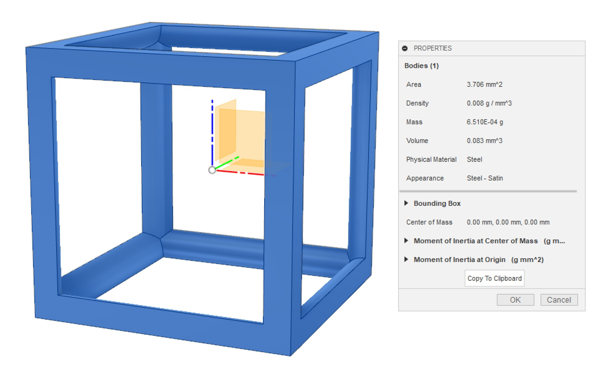
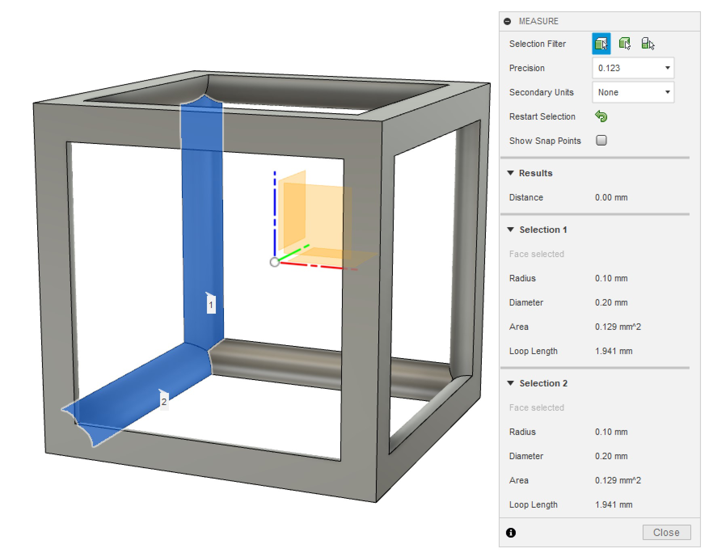
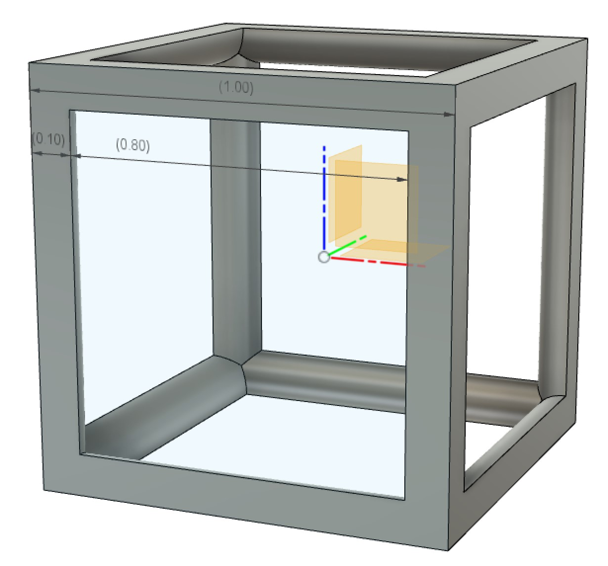
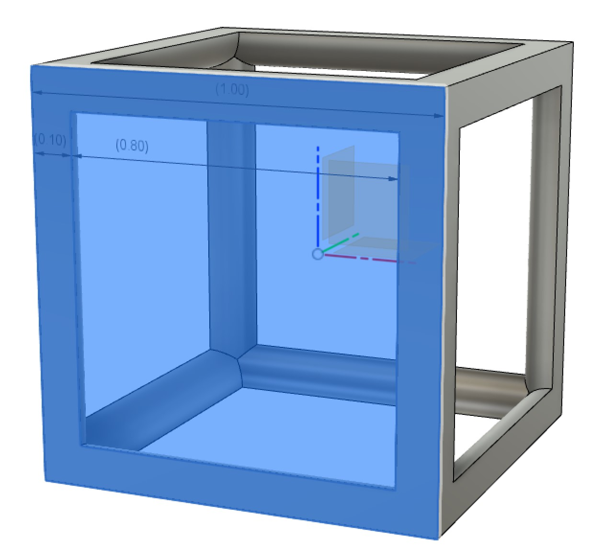
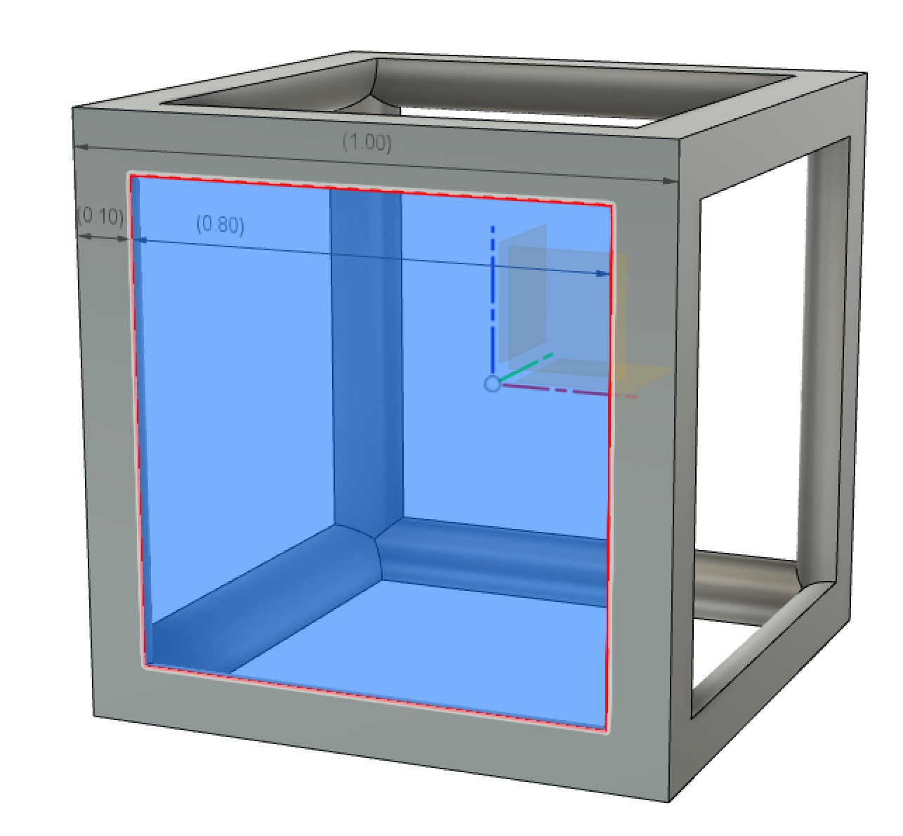
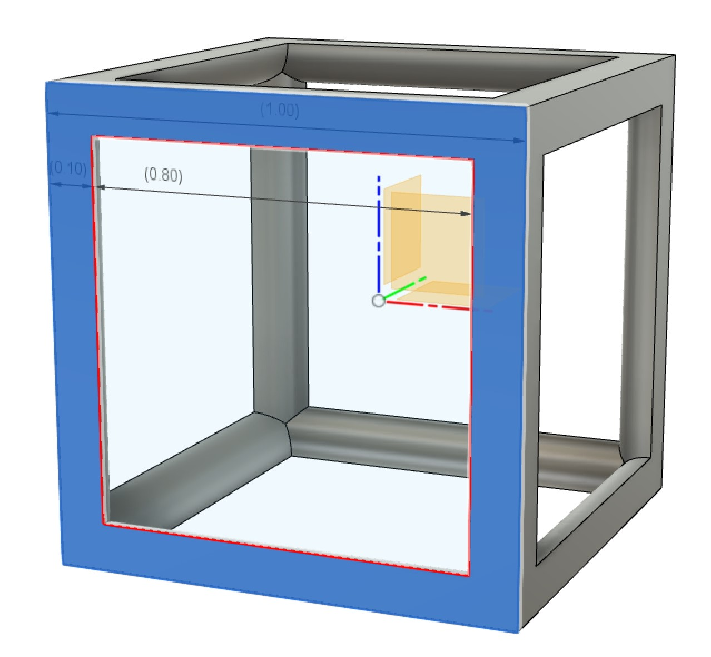
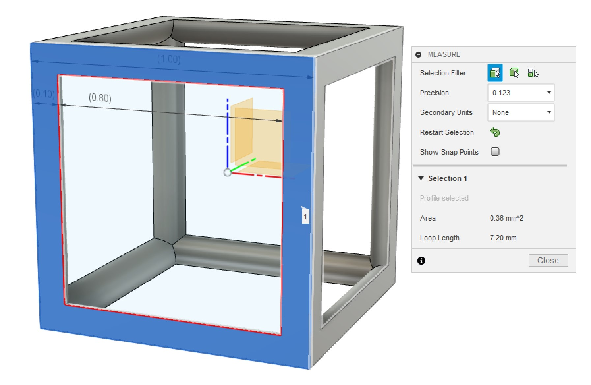
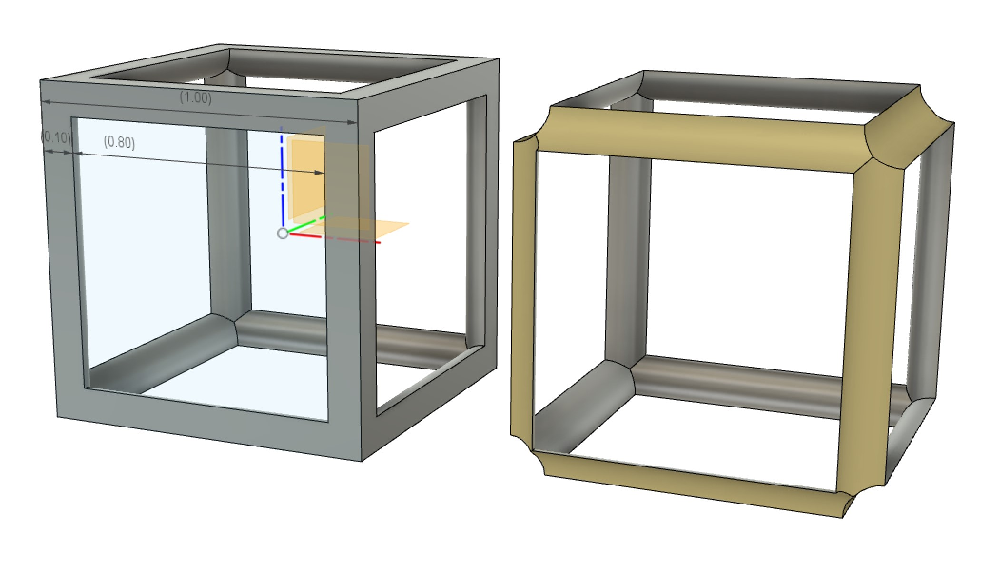
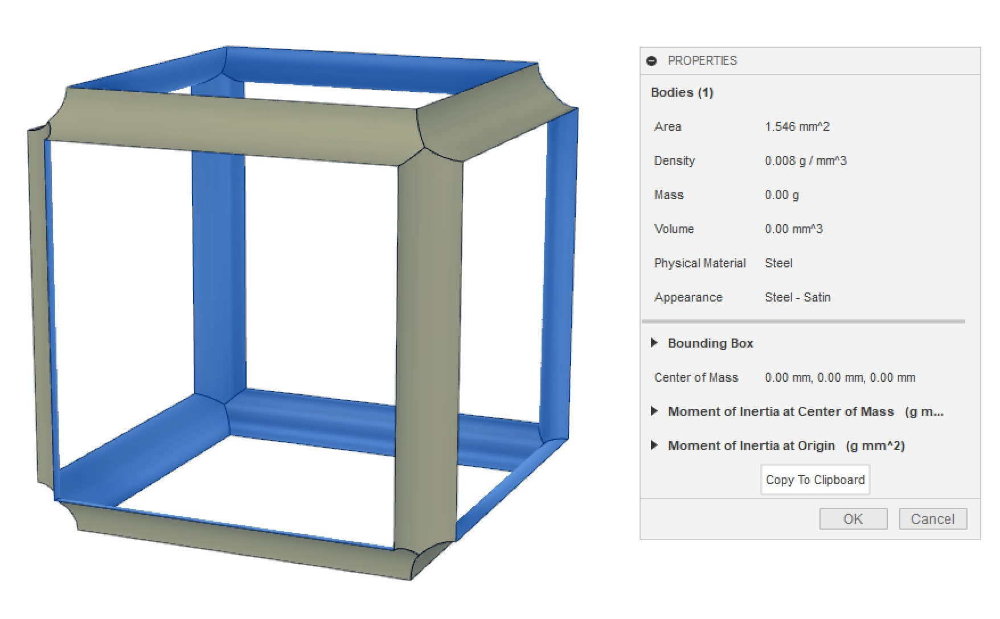

```{r setup, include=FALSE}
knitr::opts_chunk$set(echo = FALSE)
```


# Objective
Calculate the surface area for a single unit cell with arbitrary geometry and size.

# Tools
- Fusion 360 solid modeling
- Optional: Fusion 360 surface modeling
- Preferred numerical tools (Calculator, Excel, Python, etc)

# Problem Statement
To apply the Klumpp or Inayat models for predicting, it's necessary to know the surface area of the geometry contacting the fluid on a per-volume basis ($SA_v$). This property can be determined for a single cell within the CAD software, but the direct CAD output for a solid cell is an overestimate (see Figure \@ref(fig:fusion-default-output)). Furthermore, the measure function is limited in the number of surfaces that can be selected, which limits throughput for more complex geometries (see Figure \@ref(fig:fusion-default-measure)).

```{r fusion-default-output, echo=FALSE, out.width="100%", fig.align="center", fig.cap="Default surface area output from Fusion360. The area estimate includes faces that are part of the solid body not in contact with the fluid."}

```

```{r fusion-default-measure, echo=FALSE, out.width="100%", fig.align="center", fig.cap="Output of the Measure tool. Up to two surfaces can be selected for measurement."}

```


# Procedure
Here we will examine a unit cube with the cubic lattice geometry and strut radius $r = 0.1\ mm$. The geometry and dimensions are shown in Figure \@ref(fig:fusion-cube-sketch). We will quantify the specific surface area by two methods.

1. Analytically, using the Fusion result as an input
2. Using Fusion's surface modeling tools to create a new body

```{r fusion-cube-sketch, echo=FALSE, out.width="100%", fig.align="center", fig.cap="Dimensions of the cubic unit cell"}

```

## 1. Semi-analytical solution
The output of Fusion's properties for the solid body can be decomposed into contributions from the interior area of the beams and the exterior area of the beams at each face. The exterior beam area for any given face is the difference between the area of the closed face and the area of the virtual open face (or window).

{width=33%} {width=33%} {width=33%}.

As a result, the component area can be described by the following.

$$
\begin{aligned}
SA_{component} &= 6\ SA_{beam,\ face} + 12\ SA_{beam,\ internal} \\
&= 6\ (SA_{face} - SA_{window}) + 12\ SA_{beam,\ internal} \\
\end{aligned}
$$.

In terms of the quantity of interest,

$$\begin{aligned}
SA_v * v &= SA_{component} - 6\ SA_{beam,\ face}) \\
&= SA_{component} - 6\ (SA_{face} - SA_{window}) \\
&= 12\ SA_{beam,\ internal}
\end{aligned}
$$

For the geometry with $l_c = 1\ mm$ and $r = 0.1\ mm$, this is confirmed to be $`r 1^2 - 0.8^2`\ mm^2$, which agrees with the results from Fusion.

$$\begin{aligned}
SA_{beam,\ face} &= l_c^2 - l_w^2
\end{aligned}
$$

{width=100%}.

Therefore, 
$$
\begin{aligned}
SA_v &= 3.706 - 6\ ( `r 1^2 - 0.8^2` ) \\
&= `r 3.706 - 6*(1^2 - 0.8^2)`\ mm^{-1}
\end{aligned}
$$.

## 2. Surface modeling solution
One alternative approach is to deconstruct the solid into its component surfaces. Doing so and removing the beam area at the faces yields only the internal area of interest, as shown in Figure \@ref(fig:fusion-surface-side).

```{r fusion-surface-side, echo=FALSE, out.width="100%", fig.align="center", fig.cap="Cubic unit cell solid and internal surface"}

```

Measuring the surface area of this part again yields $$SA_v = 1.546\ mm^{-1}$$

